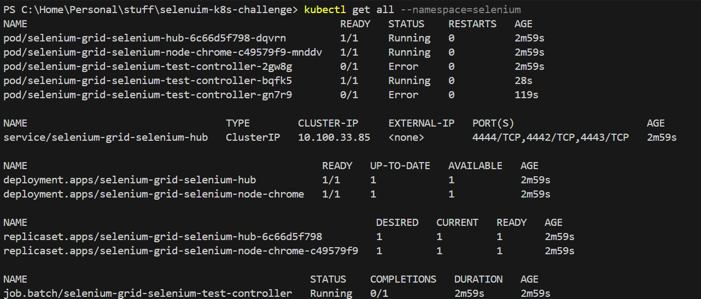

# Selenium Grid Test Infrastructure

An automated test infrastructure using Selenium Grid with Docker, Kubernetes, and Helm support. The project includes a complete test suite for web application testing, with a focus on scalability and cloud deployment.

## Overview

This project provides:
- Selenium Grid infrastructure with Hub and Node architecture
- Automated UI tests using Python and Pytest
- Multiple deployment options (Docker Compose, Kubernetes, EKS)
- Helm charts for Kubernetes deployment
- Python deployment scripts for automation
- CI/CD pipeline with GitHub Actions

## Repository Structure

```
├── .github/workflows/    # CI/CD pipeline configurations
├── docker/              # Docker-related files
│   ├── Dockerfile       # Test runner image
│   └── docker-compose.yml
├── eks/                 # EKS cluster configuration
│   └── cluster.yaml
├── helm/               # Helm chart for Selenium Grid
│   ├── Chart.yaml
│   ├── values.yaml
│   └── templates/
├── k8s/                # Raw Kubernetes manifests
├── src/                # Test suite source code
│   ├── config/         # Test configurations
│   ├── pages/          # Page objects
│   └── tests/          # Test cases
└── deploy.py           # Deployment automation script
```

## Getting Started

### Prerequisites
- Python 3.12+
- Docker and Docker Compose
- kubectl
- Helm 3
- AWS CLI (for EKS deployment)

## Test Project Structure

### Page Object Model
```
src/
├── config/
│   ├── config_test.py     # Test configuration
│   └── Locators.py        # Element locators
├── pages/
│   ├── base_page.py       # Base page class
│   ├── home_page.py       # Home page object
│   └── careers_page.py    # Careers page object
└── tests/
    ├── conftest.py        # Pytest configuration
    └── test_insider_careers.py
```
The test suite is designed to validate the Insider careers website functionality, focusing on QA job positions. It uses Selenium WebDriver with Python and follows the Page Object Model pattern for maintainable and scalable test automation.

### Test Structure

The test project follows a clear organizational structure:
- **config/**: Contains test configuration and element locators
- **pages/**: Implements the Page Object Model design pattern
- **tests/**: Contains the actual test cases and fixtures

### Available Tests
The test suite currently includes three main test scenarios:

1. **Homepage Verification**
   - Validates website accessibility
   - Verifies homepage title and content
   - Ensures basic navigation functionality

2. **Careers Page Navigation**
   - Tests navigation to careers section
   - Validates presence of key page sections
   - Checks for required UI elements

3. **QA Jobs Workflow**
   - Tests job filtering functionality
   - Validates job posting details
   - Verifies application process flow

### Test Distribution
The system uses Selenium Grid for distributed test execution:
- Hub: Central manager that distributes tests
- Nodes: Execute tests in parallel
- Tests are automatically distributed to available nodes
- Each node can handle multiple test sessions

## How It Works

### System Architecture
```
┌─────────────────┐         ┌──────────────┐         ┌─────────────────┐
│  Test Controller│         │   Selenium   │         │   Chrome Node   │
│      Pod        │◄────────►     Hub      │◄────────►      Pod       │
└─────────────────┘         └──────────────┘         └─────────────────┘
       ^                           ^                         ^
       │                           │                         │
       └───────────────────────────┼─────────────────────────┘
                                  │
                          Inter-Pod Communication
                          via Kubernetes Services
```

1. **Hub**
   - Central point of control
   - Manages test sessions
   - Load balances across nodes
   - Handles test queuing

2. **Nodes**
   - Register with hub
   - Execute tests in isolated browsers
   - Report results back to hub
   - Can be scaled horizontally

### Test Execution Flow
```
   Test Controller                Hub                     Chrome Node
        │                         │                           │
        │ ─── New Session ───────>│                           │
        │                         │ ──── Create Browser ────> │
        │                         │ <─── Node Ready ────────  │
        │ <─── Session Created ───│                           │
        │ ─── Execute Test ─────> │ ──── Run Commands ─────> │
        │                         │ <─── Results ───────────  │
        │ <─── Test Results ──────│                           │
```
1. Test requests WebDriver session from Hub
2. Hub assigns request to available Node
3. Node executes test in isolated browser
4. Results are collected and reported
5. Screenshots and logs are saved

### Kubernetes Test Execution Flow
1. **Job Creation**
   - Test controller pod starts via Kubernetes Job
   - Configured with retry logic (backoffLimit)
   - Mounts volumes for reports and screenshots

2. **Test Distribution**
   - Hub pod manages test session distribution
   - Chrome node pods execute browser sessions
   - Service discovery via Kubernetes DNS

3. **Failure Handling**
   - Job retries on test failures
   - Node failures trigger pod recreation
   - Hub maintains session queue

### Inter-Pod Communication Flow

1. **Test Controller to Hub**: 
   - Test Controller connects to Hub via `selenium-hub` service
   - Uses URL: `http://selenium-hub:4444/wd/hub`
   - Managed by Kubernetes DNS resolution

2. **Hub to Chrome Node**:
   - Chrome nodes register with Hub using event bus
   - Communication ports:
     - 4442: Event bus publish
     - 4443: Event bus subscribe
     - 5555: Node port

### Kubernetes Objects Used
1. **Deployments**
   - `selenium-hub`: Manages the central Hub instance
   - `selenium-node-chrome`: Manages Chrome browser nodes
   - Provides self-healing and rolling updates

2. **Services**
   - `selenium-hub`: Internal ClusterIP service
   - Enables service discovery and load balancing
   - Used for Hub-Node and Test-Hub communication

3. **ConfigMap**
   - Stores grid configuration
   - Environment variables for hub and nodes
   - Easily configurable without rebuilding images

4. **Job**
   - Manages test execution
   - Handles retries automatically (backoffLimit)
   - Ensures test completion or failure handling
   
   ```
     backoffLimit: 3  # Retry failed tests 3 times
     template:
       spec:
         restartPolicy: Never
   ```

## Running Tests

### 1. Using Docker Compose
```bash
# Start Selenium Grid
cd docker
docker-compose up -d
```

### 2. Using Kubernetes

#### Option 1: Raw Manifests
```bash
# Apply manifests
kubectl apply -f k8s/
# Check status
kubectl get pods
```

#### Option 2: Helm Chart
```bash
# Install chart
helm install selenium-grid ./helm
# Check status
kubectl get pods -n selenium
```

#### Option 3: Python Deploy Script
```bash
# Deploy with default configuration
python deploy.py
# Deploy with custom configuration
python deploy.py --node-count 3 --max-retries 5
```

### 3. Using EKS
```bash
# Create EKS cluster
eksctl create cluster -f eks/cluster.yaml
# Deploy Selenium Grid
helm install selenium-grid ./helm
```

## CI/CD Pipeline

The project includes GitHub Actions workflow with two main jobs for pushing docker images for test controller to [docker hub repository](https://hub.docker.com/repository/docker/gryoussef/selenuim-tests) and helm chart in github artifacts.

## Demo Screenshots

Here are some screenshots demonstrating the setup and execution:

1. Helm Chart Installation


2. Kubernetes Objects


3. Test Execution


Error logs while selecting Istanbul option


